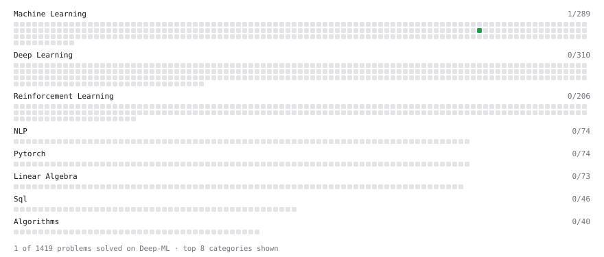

# Deep-ML

My machine learning practice from [Deep-ML](https://www.deep-ml.com). Every solution here was written by hand.

**3** solved · 3 problems · 0 labs · 0 math

[**Browse the interactive portfolio**](https://DarkKnightBatman.github.io/deep-ml/) to replay this filling in over time.

## Problems

| | Difficulty | Solved | |
| --- | --- | --- | --- |
| [Rejection Sampling Best-of-K Selection](https://www.deep-ml.com/problems/768) | easy | 2026-09-21 | [solution](problems/0768-rejection-sampling-best-of-k-selection) |
| [Chunked Prefill Scheduling Alongside Decode](https://www.deep-ml.com/problems/441) | medium | 2026-09-21 | [solution](problems/0441-chunked-prefill-scheduling-alongside-decode) |
| [Training FLOPs Accountant and Capability Gate](https://www.deep-ml.com/problems/1335) | medium | 2026-09-21 | [solution](problems/1335-training-flops-accountant-and-capability-gate) |

---

_This file is regenerated by Deep-ML on every push._
